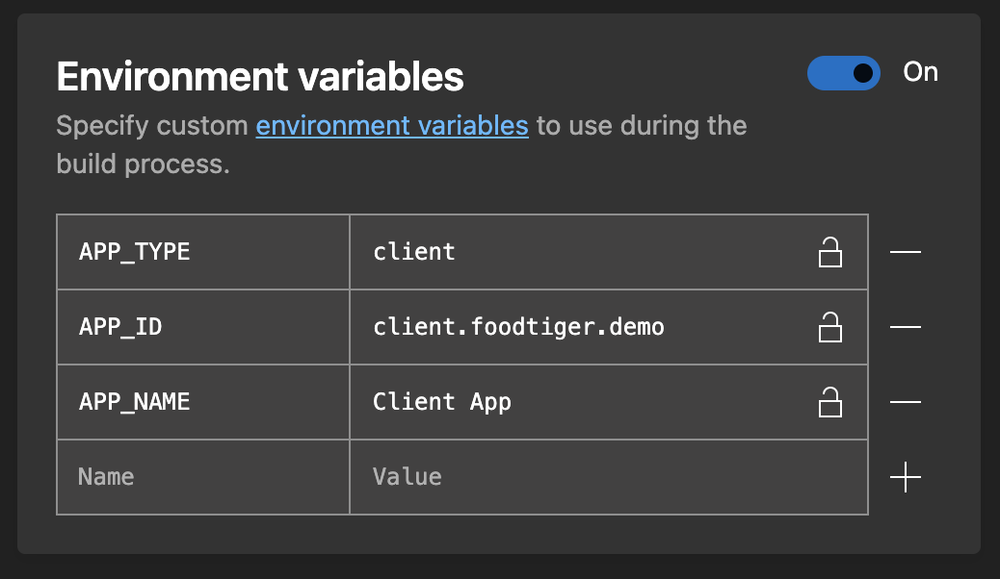

# AppCenter.ms

Up till now, the previous steps were for you to configure your app. 

At this step, you can decide if you want to publish the app from your computer or use [AppCenter.ms](https://appcenter.ms/) to do that.

The video below is how you should do it in AppCenter.


You need to set two environment variables in AppCenter.ms \( not recorded in video \)


```text
APP_NAME="My Super Food"
APP_ID="com.mycomapany.appname"
```






